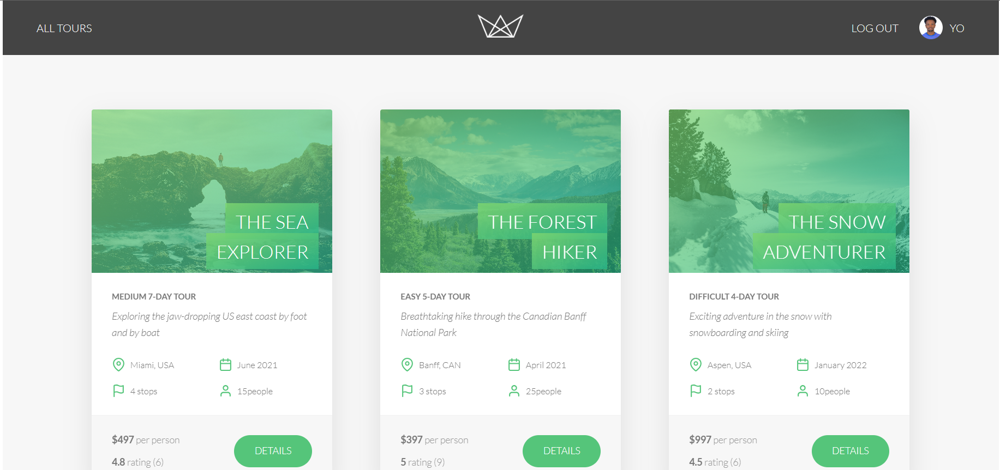

# Greenscape 


🏕️ A modern tour booking web application . Greenscape provides server-rendered pages using Pug, a REST API, authentication, image uploads, Stripe checkout integration, and Mapbox maps.

---

## 📖 Table of Contents

- [✨ Features](#-features)
- [🛠️ Tech Stack](#-tech-stack)
- [🚀 Getting Started](#-getting-started)
  - [Prerequisites](#prerequisites)
  - [Installation](#installation)
- [🎯 Usage](#-usage)
- [📂 Project Structure](#-project-structure)
- [📁 Important Files](#-important-files)
- [🤝 Contributing](#-contributing)
- [📄 License](#-license)

---

## ✨ Features

- Browse tours with image galleries and map locations
- User authentication (JWT) and profile management
- Create/read/update/delete tours and reviews
- Image upload and server-side resizing with `sharp`
- Stripe checkout integration for bookings
- Map visualization using Mapbox (see `public/tour.html`)
- Security middlewares: `helmet`, `express-mongo-sanitize`, `xss-clean`, rate limiting

---

## 🛠️ Tech Stack

- **Backend:** Node.js, Express
- **Database:** MongoDB (Mongoose)
- **Templating / Views:** Pug
- **Frontend:** Vanilla JS (bundled with Parcel), CSS
- **Auth:** JSON Web Tokens (JWT)
- **Payments:** Stripe
- **Maps:** Mapbox GL JS
- **File uploads:** Multer

---

## 🚀 Getting Started

### Prerequisites

- Node.js (v10+)
- npm (or pnpm)
- A MongoDB database (local or Atlas)
- Mapbox token (for map view)
- Stripe keys (for payments)
- SMTP credentials (for emails)

### Installation

1. Clone the repository and change directory:

```bash
git clone <repo-url>
cd Greenscape
```

2. Install dependencies:

```bash
npm install
# or
pnpm install
```

3. Copy `config.env` to `.env` (or create `.env`) and populate the required environment variables (DB connection, JWT secret, Mapbox, Stripe, SMTP).

---

## 🎯 Usage

Start the server in development (uses `nodemon`):

```bash
npm run start
```

Start production mode:

```bash
npm run start:prod
```

Debug server:

```bash
npm run debug
```

Parcel scripts for frontend assets:

```bash
npm run watch:js    # watch and rebuild bundle during development
npm run build:js    # production bundle
```

By default the app listens on the port set in your environment (see `server.js`). Open `http://localhost:3000` (or configured port) after starting the server.

### Import sample data

Seed the database with example tours, users and reviews using the import helper:

```bash
node dev-data/import-dev-data.js --import
```

Remove seeded data:

```bash
node dev-data/import-dev-data.js --delete
```

---

## 📂 Project Structure

- `app.js` — Express app and middleware
- `server.js` — server bootstrap and DB connection
- `controllers/` — route handlers (tours, users, bookings, reviews, views)
- `models/` — Mongoose models
- `routes/` — Express routes
- `views/` — Pug templates
- `public/` — static frontend assets (CSS, images, client JS)
- `dev-data/` — seed data and import script
- `utils/` — helper utilities (email, error handling, features)

---

## 📁 Important Files

- `package.json` — scripts and dependency list
- `config.env` — example environment file (copy to `.env` for local development)
- `public/tour.html` — Mapbox demo and tour page
- `dev-data/import-dev-data.js` — import/delete sample data

---

## 💻 Live Demo

[🌐 Greenscape](#)

## 📸 Screenshots

### Greenscope website

